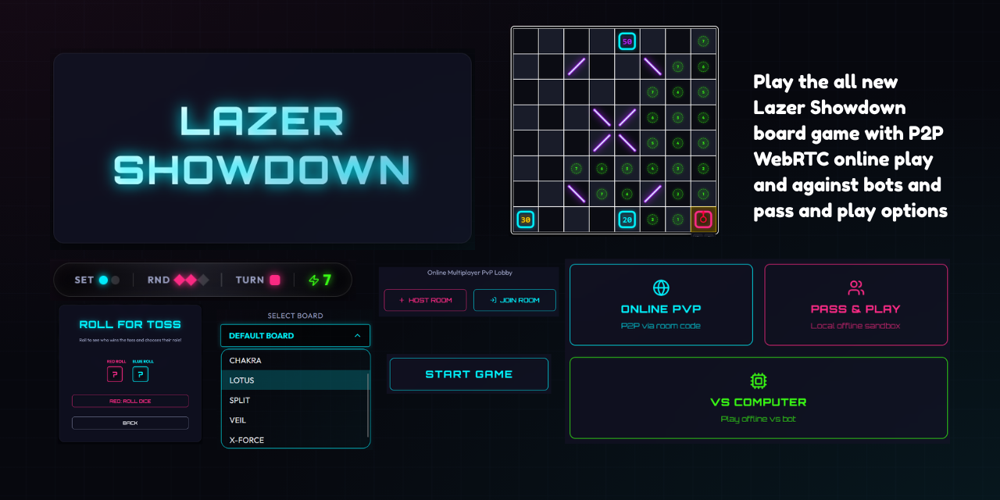

<div align="center">

     
**A futuristic 1v1 laser-reflection strategy board game.**
*Born on the battlefield of Planet Ser. Played across the galaxy.*

[](https://react.dev)
[](https://vite.dev)
[](https://peerjs.com)
[](https://web.dev/progressive-web-apps/)

[▶ **Play Now**](https://denzven.github.io/Lazer-Showdown) · [📖 Rules](#-the-rules) · [🌌 Lore](#-the-lore) · [🛠️ Dev Setup](#️-getting-started)

</div>

---

## ✦ What Is Lazer Showdown?

**Lazer Showdown** is a two-player tactical board game played on an **8×8 grid** filled with fixed diagonal mirrors. One player is the **Attacker**, wielding a laser piece. The other is the **Defender**, protecting high-value point pieces by repositioning them around the board.

A roll of the dice determines your **Action Points**. Use them to move your piece, rotate the laser, and fire - but every shot bounces off the board's mirrors unpredictably. Mastering the geometry of the beam is the key to victory.

> *"The original name was 'La-Sir-She-Dan' - Battle of the Land at Ser. The humans couldn't pronounce it. So they called it Lazer Showdown. And somehow, that name ended a war."*

---

## 🎮 Game Modes

| Mode | Description |
|------|-------------|
| 🌐 **Online (WebRTC)** | Real-time peer-to-peer multiplayer. Share a 6-character room code with a friend. No server needed. |
| 👥 **Local Pass & Play** | Two players sharing one device, taking turns. Perfect for sitting across from each other. |
| 🤖 **vs. Computer** | Challenge one of three AI opponents, each with a unique personality and playstyle. |

---

## 📋 The Rules

> *This is a condensed summary. The full official ruleset is inside the game under* **Rules***.*

### 🏗️ Structure
```
GAME  ─→  2 SETS
SET   ─→  3 ROUNDS
ROUND ─→  Defender's Roll  +  Attacker's Roll
```

### ⚙️ Setup
1. **Toss** - Both players roll one die. The higher roller wins and **chooses their role**.
2. **Defender** places **3 Point Pieces** anywhere on the board *except* the four corners.
3. **Attacker** places the **LAZER Piece** on any corner square, facing any direction.

### 🎲 Your Turn (Rolling & Actions)
- Roll **both dice** - the total is your **Action Points (AP)**.
- Spend each AP on one of three actions:

| Action | Cost | Who Can Use |
|--------|------|-------------|
| **MOVE** | 1 AP | Attacker moves LAZER 1 square (H/V only). Defender moves a Point Piece 1 square. |
| **ROTATE** | 1 AP | Attacker rotates the LAZER piece clockwise or counter-clockwise. |
| **LAZER PRESS** | 1 AP | Fires the laser. It travels, bounces off mirrors, and captures any Point Piece it hits. |

- Actions can be taken in **any order**.
- Unused AP is **forfeited**.

### 💥 The Laser
When fired, the laser travels in a straight line until it:
- **Bounces** off a `/` or `\` mirror (90° reflection).
- **Captures** a Point Piece (piece is removed, points awarded to Attacker).
- **Exits** the board.

Mirror loops are detected and broken automatically to prevent infinite bouncing.

### 🏆 Scoring & Objectives

| Piece | Points |
|-------|--------|
| Small Piece | 20 pts |
| Medium Piece | 30 pts |
| Large Piece | 50 pts |

- **Attacker** wants to capture all pieces and score as many points as possible.
- **Defender** wants to evade capture, delay the attacker, and survive all 3 rounds.

### ⚡ Challenge Mechanic
If the Attacker captures **all 3 pieces** before the set ends, they may declare a **CHALLENGE**:

1. The Attacker nominates one previously captured piece.
2. A **toss** is rolled (one die per player).
3. **Attacker wins toss** → Defender re-places all pieces; the game continues. If the challenged piece is captured again, its value is **added** to the score.
4. **Attacker loses toss** → The nominated piece's value is **deducted** from the Attacker's score.

Multiple challenges can occur in a single set!

### 🔄 Between Sets
After Set 1, **roles are swapped**. The former Attacker becomes the Defender, and vice versa. Scores carry over. The player with the **highest total score** after both sets wins. A tie is a **DRAW**.

---

## 🌌 The Lore

> *The full lore archive is accessible in-game via the **"GRID TERMINAL ARCHIVES"** section.*

### Chapter I - The Great Discovery (3021 AD)

The war on **Planet Ser** had reached a brutal stalemate. In the dead of night, allied scouts observed alien commanders playing a mysterious game with living creatures on stone grids. They heard its name whispered: **"La-Sir-She-Dan"** - *Battle of the Land at Ser*.

Back at base, the name became **"Lazer Showdown"** - and what had been the enemy's battle simulation became humanity's most valuable intelligence asset.

### Chapter II - The Strategic Breakthrough

A cryptographer made a terrifying discovery: the placement of pieces on the alien game boards **perfectly matched the coordinates of their fleet ships in orbit**. It wasn't a pastime. It was a **real-time tactical simulation**.

By reverse-engineering the game with mirrors and rudimentary lasers, human soldiers began to predict alien flanking maneuvers - days before they occurred.

### Chapter III - The Treaty of 3042

In **3042 AD**, the **Intergalactic Treaty of Kylos** was signed, ending decades of war. Lazer Showdown was no longer a weapon of intelligence - it became a bridge between civilizations. Today it is played across the galaxy as a sport of diplomacy.

---

## 👾 Alien Bestiary

The creatures from Planet Ser that inspired the game pieces.

### 🔦 The Lzrshuby - *The Laser*
> *"Tickle its foot. That's all it takes."*

A furry, baseball-sized creature from the **High-Energy Vents of Planet Ser**. It feeds on ambient radiation, making it essentially a living battery. When startled or tickled, it vents excess radiation through a singular ocular lens - creating a focused beam of pure energy.

In the human version of the game, the **Attacker's Laser Piece** is modeled after the Lzrshuby.

### 🪨 The Mirlug - *The Mirror*
> *"99.9% reflectivity. Even plasma just bounces right off."*

A slow-moving gastropod from the **Silicon Caves of Planet Ser**. Its shell is composed of high-density, naturally polished silicon - so reflective it can redirect high-energy plasma beams with near-perfect efficiency.

During the war, Mirlugs were used as tactical redirection pads. In the game, **Mirror pieces** are modeled after their extraordinary shells.

---

## 🤖 AI Opponents

Three alien contenders await in Bot Mode, each with a distinct personality coded directly into their decision engine.

### 🟢 Zlorooklp - *Veteran Scout (Easy)*
> *"He views the game as a casual hobby. He's here for the pretty lights."*

One of the first aliens to play a friendly match with a human after the ceasefire. Forgiving and experimental. He has a **15% chance to simply skip an action** to "see what happens."

**AI Behavior:** Picks moves at random from the legal action pool. Occasionally forfeits AP on purpose.

---

### 🟡 Lizbishmir - *Tactical Scholar (Medium)*
> *"She believes every move has a perfect geometric counter."*

A scholar of the Ser battlefields, obsessed with the mathematical precision of the grid. Methodical and balanced - she rarely makes aggressive mistakes.

**AI Behavior (Attacker):** Prioritizes immediate captures → rotation setups → positional movement toward the closest piece.
**AI Behavior (Defender):** Moves pieces toward the **center** of the board for maximum coverage. Evades targeted pieces first.

---

### 🔴 Shahlzrmir - *High-Command Marshal (Hard)*
> *"He has never forgotten a single ship placement from the war."*

A high-ranking officer from the original conflict. Plays with cold, calculating efficiency. Uses Action Points to trap opponents in inescapable configurations.

**AI Behavior (Attacker):** Same capture-first logic as Lizbishmir, but relentlessly aggressive.
**AI Behavior (Defender):** Moves pieces toward **board edges** for a perimeter defense. Evades threats first, then repositions to maximize distance from the laser.

---

## 🗺️ Custom Boards

Lazer Showdown ships with **5 distinct board configurations**, each offering a unique mirror pattern that radically changes the tactical landscape.

| Board | Description |
|-------|-------------|
| **Default** | The classic 8-mirror layout from `Ruleset.js`. |
| **Chakra** | A radially symmetric pattern with central mirror clusters. |
| **Lotus** | Balanced positioning mirroring the Chakra, with alternate orientations. |
| **Split** | A sparse 4-mirror board that favors direct shots. |
| **Veil** | A 6-mirror layout designed to occlude laser paths. |
| **X-Force** | A dense 12-mirror cross-pattern creating complex reflection chains. |

The board layout is **fixed for the entire game**. Mirrors cannot be moved. Every strategy must be built around the beam geometry they create.

---

## 🔗 Networking Architecture (WebRTC)

Lazer Showdown uses **100% peer-to-peer networking** - no game server is required.

```
Player 1 (Host)                         Player 2 (Joiner)
     │                                        │
     │── registers peer ID ─────────────────► │
     │   "lazershowdown-XXXXXX"               │
     │                                        │
     │◄────── PeerJS signaling server ────────│
     │           (discovery only)             │
     │                                        │
     │◄════════ WebRTC DataChannel ═══════════│
     │        (direct P2P game data)          │
```

1. **Host** creates a room → a unique **6-character room code** is generated (e.g., `KRTV4Y`).
2. The host registers as a PeerJS peer with the ID `lazershowdown-XXXXXX`.
3. **Joiner** enters the code → connects directly to the host's peer.
4. A **handshake** is performed to exchange player names and session IDs.
5. All game state actions (`move`, `rotate`, `laser-press`, etc.) are broadcast via the DataChannel.
6. **Full room protection** - a second joiner attempting to connect to an active room receives a `ROOM_FULL` rejection.

### Resilience Features
- 🔄 **Auto-reconnect** - if a tab is closed and reopened, the session is restored from `localStorage`.
- 💤 **AFK detection** - the Page Visibility API monitors tab focus; opponents are notified if you go AFK for 5+ seconds.
- 🔁 **Room code collision retry** - if a room ID is already taken, the host auto-generates a new one (up to 3 retries).

---

## 🏗️ Project Architecture

```
lazer-showdown-webrtc/
├── public/                         # Static assets & PWA icons
│
└── src/
    ├── core/
    │   ├── Ruleset.js              # Game constants, laser tracing, board setup, move validation
    │   ├── GameState.js            # Immutable state reducer - all game action logic lives here
    │   └── BotEngine.js            # AI decision engine for all three difficulty tiers
    │
    ├── hooks/
    │   ├── useGame.js              # React hook - bridges game state, network, and bot turns
    │   └── useNetwork.js           # React hook - manages WebRTC connection lifecycle
    │
    ├── network/
    │   ├── Signaling.js            # PeerJS wrapper for room hosting & joining
    │   └── DataChannel.js          # Typed message wrapper over PeerJS DataConnection
    │
    ├── components/
    │   ├── Board/
    │   │   ├── Grid.jsx            # 8×8 board renderer with real-time laser path visualization
    │   │   └── Cell.jsx            # Individual cell renderer (pieces, mirrors, laser beam)
    │   ├── Lobby/
    │   │   └── ConnectionScreen.jsx # Online multiplayer lobby UI
    │   ├── Layout.jsx              # In-game HUD, dice controls, scoreboard, action log
    │   └── InstallPWA.jsx          # Cross-platform PWA install prompt
    │
    ├── boards/                     # JSON custom board mirror configurations
    │   ├── Chakra.json
    │   ├── Lotus.json
    │   ├── Split.json
    │   ├── Veil.json
    │   └── X-force.json
    │
    ├── lore/                       # Story files, character bios, and artwork
    │   ├── 01_The_Great_Discovery.txt
    │   ├── 02_The_Strategic_Breakthrough.txt
    │   ├── 03_The_Treaty_of_3042.txt
    │   ├── Bio_The_Lzrshuby.txt
    │   ├── Bio_The_Mirlug.txt
    │   ├── Char_Zlorooklp.txt
    │   ├── Char_Lizbishmir.txt
    │   ├── Char_Shahlzrmir.txt
    │   └── rules.txt
    │
    └── App.jsx                     # Root component - routing & mode management
```

### Key Design Decisions

- **Immutable State** - `GameState.js` is a pure reducer: `(board, action, player, context) → nextState`. No mutation; every action returns a fresh state snapshot.
- **Laser Tracing** - `traceLaserBeam()` uses a visited-set keyed by `(r, c, dr, dc)` to prevent infinite mirror loops. Returns the full beam path for the renderer.
- **Bot as Sandbox Player** - The bot uses the same `applySandboxAction()` as a human. It's an AI that simply picks the action; no special code paths needed.
- **No Backend** - Zero game server. State sync happens over WebRTC DataChannels. PeerJS's signaling server is only used for the initial connection handshake.

---

## 🛠️ Getting Started

### Prerequisites
- **Node.js** `>= 18`
- **npm** `>= 9`

### Installation

```bash
git clone https://github.com/denzven/Lazer-Showdown.git
cd Lazer-Showdown
npm install
```

### Development

```bash
npm run dev -- --host
```

> **Note:** HTTPS is enabled automatically via `vite-plugin-mkcert`. This is **required** for WebRTC to function. Your browser may display a certificate warning on first launch - this is expected for local development.

The game will be accessible at:
- `https://localhost:5173` - local machine
- `https://<your-local-ip>:5173` - on your LAN (for cross-device P2P testing)

### Building for Production

```bash
npm run build       # Produces the dist/ folder
npm run preview     # Preview the production build locally
```

### Deploying to GitHub Pages

```bash
npm run deploy
```

This runs `vite build` and then publishes the `dist/` folder via `gh-pages`.

---

## 📦 Tech Stack

| Technology | Purpose |
|------------|---------|
| **React 19** | UI Framework |
| **Vite 8** | Build tool & dev server |
| **PeerJS** | WebRTC abstraction (signaling + data channels) |
| **vite-plugin-pwa** | Progressive Web App manifest & service worker |
| **vite-plugin-mkcert** | Local HTTPS for WebRTC compatibility |
| **lucide-react** | Icon set |
| **react-markdown** | Renders lore `.txt` files as Markdown with image support |
| **canvas-confetti** | Victory celebrations 🎉 |
| **mobile-drag-drop** | Touch drag-and-drop polyfill for mobile gameplay |
| **Oxlint** | Fast JavaScript linting |
| **gh-pages** | One-command GitHub Pages deployment |

---

## 📱 Progressive Web App (PWA)

Lazer Showdown is installable as a **standalone app** on any device:

- **Android / Chrome** - "Add to Home Screen" prompt appears automatically.
- **iOS / Safari** - Share → "Add to Home Screen".
- **Desktop (Chrome / Edge)** - Install button in the browser address bar.

The PWA runs in `standalone` mode (no browser chrome), supports all screen orientations, and auto-updates via a registered service worker.

---

## 🤝 Contributing

This is a private project. If you have been invited to contribute:

1. Fork the repository.
2. Create a feature branch: `git checkout -b feat/your-feature`
3. Commit your changes: `git commit -m 'feat: add your feature'`
4. Push to your branch: `git push origin feat/your-feature`
5. Open a Pull Request.

---

<div align="center">

*"The soldiers who first tickled a Lzrshuby in a trench would never have believed that their desperate attempt to survive would become the galaxy's greatest legacy."*

- *The Treaty of Kylos, 3042 AD*

---

**Made with ⚡ and a healthy respect for laser physics.**

*Made with Love by DZVN 💜 with Google Antigravity 🤖*

</div>
