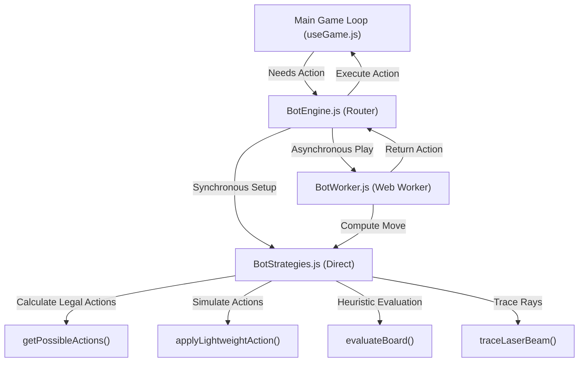

# 🤖 Lazer Showdown Bot Development Guide

Welcome to the **Lazer Showdown Bot Development Guide**! This document provides everything you need to know to write, integrate, and programmatically test custom AI bots for the game. 

Whether you want to build a simple rule-based agent, a search-based Minimax bot, or train your own neural/heuristic weights using a Genetic Algorithm, this guide will walk you through the codebase architecture and APIs.

---

## ✦ System Architecture Overview

The bot system is built to be modular, fast, and completely decoupled from the React rendering thread. It consists of the following key components:



1. **`BotEngine.js` ([BotEngine.js](file:///d:/Lazer_showdown_WebRTC/src/core/BotEngine.js))**: The main-thread entry point. It handles synchronous setup actions and dispatches play-actions to a background Web Worker. If the Web Worker is blocked or fails, it transparently falls back to running synchronously on the main thread.
2. **`BotWorker.js` ([BotWorker.js](file:///d:/Lazer_showdown_WebRTC/src/core/BotWorker.js))**: A dedicated Web Worker that runs bot calculations off the main thread, keeping the user interface completely fluid even during heavy depth-3 board search operations.
3. **`BotStrategies.js` ([BotStrategies.js](file:///d:/Lazer_showdown_WebRTC/src/core/BotStrategies.js))**: The core strategy file containing all AI personalities (Easy, Medium, Hard, GA), heuristic evaluation functions, threat-mapping logic, and search algorithms.
4. **`Ruleset.js` ([Ruleset.js](file:///d:/Lazer_showdown_WebRTC/src/core/Ruleset.js))**: Holds the physical rules of the board, validation checks, and the laser tracing raycaster.

---

## 📋 The Board & Action Data Formats

### 1. Board Coordinates & Layout
The board is represented as an **8×8 2D array** of objects or `null` for empty cells:
- Rows are indexed `0` to `7` (from top to bottom).
- Columns are indexed `0` to `7` (from left to right).

```
   (0,0) [TL Corner] ─── (0,7) [TR Corner]
     │                      │
     │                      │
   (7,0) [BL Corner] ─── (7,7) [BR Corner]
```

### 2. Grid Elements (Cell Objects)
Cells are represented by objects with a `type` property:
- **Mirror**: `{ type: 'mirror', orientation: '/' | '\\' }`
- **Laser**: `{ type: 'block-lazer', rotation: 0 | 90 | 180 | 270 }`
- **Point Pieces**: `{ type: 'block-20' | 'block-30' | 'block-50' }`

### 3. Action Formats
A bot returns a single action object representing one discrete choice. Actions are passed directly to `applySandboxAction` to update the game state.

#### **Setup/Placement Actions**
- **Place Piece**:
  ```json
  { "type": "place", "pieceType": "block-50", "r": 2, "c": 3, "rotation": 90 }
  ```
- **Confirm Setup**:
  ```json
  { "type": "confirm-setup" }
  ```

#### **Play Actions**
- **Move Piece**:
  ```json
  { "type": "move", "fromR": 0, "fromC": 0, "toR": 1, "toC": 0 }
  ```
- **Rotate Laser**:
  ```json
  { "type": "rotate", "dir": "cw" | "ccw", "r": 0, "c": 0 }
  ```
- **Fire Laser**:
  ```json
  { "type": "laser-press" }
  ```
- **Declare Challenge**:
  ```json
  { "type": "declare-challenge", "declare": true, "pieceType": "block-50" }
  ```

---

## 🛠️ Core APIs and Heuristic Helper Functions

When writing your bot, you can leverage several helper methods built into the game's core files.

### 1. State Parsing & Action List
- **`getBoardState(board)`**
  Extracts point pieces, the laser position/direction, and empty cells.
  ```javascript
  const { pointPieces, lazerPos, lazerDir, emptyCells } = getBoardState(board);
  ```
- **`getPossibleActions(board, role)`**
  Returns an array of all legal action objects for the given role (`'attacker'` or `'defender'`).
  ```javascript
  const legalMoves = getPossibleActions(board, 'attacker');
  ```

### 2. Raycasting & Simulation
- **`traceLaserBeam(board, position, direction)`**
  Simulates a laser beam from `position` (`{r, c}`) going in `direction` (0, 90, 180, 270). Returns:
  - `path`: Array of coordinate steps (`{ r, c, type }`) the beam traveled.
  - `hitPiece`: The coordinate and cell object of any piece hit by the laser, or `null` if the laser exited the board.
  ```javascript
  const result = traceLaserBeam(board, { r: 0, c: 0 }, 90);
  if (result.hitPiece) {
    console.log(`Laser hit ${result.hitPiece.cell.type} at (${result.hitPiece.r}, ${result.hitPiece.c})`);
  }
  ```
- **`applyLightweightAction(board, action)`**
  **CRITICAL FOR LOOKAHEAD:** Returns a *copy* of the board with the given action applied. This allows you to simulate the future board state without mutating the actual game state.
  ```javascript
  const futureBoard = applyLightweightAction(board, action);
  ```

### 3. Pathfinding & Heatmaps
- **`generateThreatMap(board)`**
  Generates an 8×8 grid where each cell lists:
  - `total`: Cumulative threat probability (0.0 to 1.0) of a laser hit.
  - `sources`: Heatmap contributions from different rotations/positions.
  - *Note: On Defender turns, this lookup is memoized and operates in $O(1)$ time.*
- **`getPieceThreatLevels(board)`**
  Returns a list of point pieces sorted by their current laser threat levels.
- **`computeSafetySteps(board, startR, startC, threatMap)`**
  Performs a BFS from a piece's starting coordinates to find the number of steps required to reach a "safe zone" (threat $\le 0.25$). Used to guide defenders away from danger lanes.

---

## ✍️ How to Write a Custom Bot

Every bot strategy must satisfy the **Strategy Interface**:
```javascript
export const MyCustomStrategy = {
  /**
   * Called during setup/placement phases.
   * @returns {Object} A setup action object (place or confirm-setup)
   */
  getSetupAction: (board, phase, playerColor, challengedPiece) => {
    // Return a placement or confirmation
  },

  /**
   * Called during the action-playing phase.
   * @returns {Object|null} A play action object, or null to end turn
   */
  getPlayAction: (board, role, actionPoints, gameState, botPlayer) => {
    // Return move, rotate, laser-press, or null
  },

  /**
   * Called during the challenge-declaration phase.
   * @returns {Object} A challenge declaration action object
   */
  getChallengeAction: (board, gameState, playerColor) => {
    // Return a declare-challenge action:
    // { type: 'declare-challenge', declare: true, pieceType: 'block-50' }
    // or { type: 'declare-challenge', declare: false }
  }
};
```

### Example: A Balanced Evaluator Bot (`SpectreBot`)
Below is an implementation of a custom bot that uses a look-ahead score evaluator to decide its play actions and implements smart challenge checks:

```javascript
import { 
  getBoardState, 
  getPossibleActions, 
  applyLightweightAction, 
  traceLaserBeam, 
  getPieceThreatLevels 
} from './BotStrategies.js';

export const SpectreStrategy = {
  getSetupAction: (board, phase, playerColor, challengedPiece) => {
    // For simplicity, reuse the game's robust Hard placement logic
    return HardStrategy.getSetupAction(board, phase, playerColor, challengedPiece);
  },

  getPlayAction: (board, role, actionPoints, gameState, botPlayer) => {
    const actions = getPossibleActions(board, role);
    if (actions.length === 0) return null;

    let bestAction = null;
    let bestScore = -Infinity;

    for (const action of actions) {
      // 1. Simulate the action
      const futureBoard = applyLightweightAction(board, action);

      // 2. Evaluate the simulated board
      let score = 0;
      if (role === 'attacker') {
        score = evaluateAttackerState(futureBoard);
      } else {
        score = evaluateDefenderState(futureBoard);
      }

      // 3. Keep the best action
      if (score > bestScore) {
        bestScore = score;
        bestAction = action;
      }
    }

    return bestAction;
  },

  getChallengeAction: (board, gameState, playerColor) => {
    // Spectre bot only risks a challenge roll if a 50-point piece has been captured
    const captured = gameState.capturedPieces || [];
    if (captured.includes('block-50')) {
      return { type: 'declare-challenge', declare: true, pieceType: 'block-50' };
    }
    return { type: 'declare-challenge', declare: false };
  }
};

// Heuristic: Attacker wants to maximize threat and immediately fire if a hit is active
function evaluateAttackerState(board) {
  const { lazerPos, lazerDir } = getBoardState(board);
  if (!lazerPos) return -99999;

  let score = 0;

  // Primary Reward: If laser beam hits a point piece, add value
  const trace = traceLaserBeam(board, lazerPos, lazerDir);
  if (trace.hitPiece && ['block-20', 'block-30', 'block-50'].includes(trace.hitPiece.cell.type)) {
    score += 50000;
  }

  // Secondary Reward: Add points for pieces close to being aligned
  const threats = getPieceThreatLevels(board);
  for (const t of threats) {
    score += t.threatLevel * 1000;
  }

  return score;
}

// Heuristic: Defender wants to minimize threat to pieces
function evaluateDefenderState(board) {
  let score = 0;
  const threats = getPieceThreatLevels(board);
  
  // Threat penalty: subtract points for pieces under fire
  for (const t of threats) {
    score -= t.threatLevel * 5000;
  }

  return score;
}
```

---

## 🔌 Integrating a New Bot into the System

To add your custom bot to the game so users can play against it in the web interface, follow these steps:

### Step 1: Export Strategy from `BotStrategies.js`
Open [BotStrategies.js](file:///d:/Lazer_showdown_WebRTC/src/core/BotStrategies.js) and paste your strategy object at the bottom. Ensure you export it:
```javascript
export const SpectreStrategy = { ... };
```

### Step 2: Register in `BotEngine.js`
Open [BotEngine.js](file:///d:/Lazer_showdown_WebRTC/src/core/BotEngine.js) and perform the following updates:
1. Import your strategy:
   ```diff
   - import { EasyStrategy, MediumStrategy, HardStrategy, GAStrategy, ... } from './BotStrategies.js';
   + import { EasyStrategy, MediumStrategy, HardStrategy, GAStrategy, SpectreStrategy, ... } from './BotStrategies.js';
   ```
2. Update `syncPlayAction`:
   ```javascript
   function syncPlayAction(board, role, actionPoints, difficulty, gameState, botPlayer) {
     // ...
     if (difficulty === 'spectre') return SpectreStrategy.getPlayAction(board, role, actionPoints, gameState, botPlayer);
     return null;
   }
   ```
3. Update `getBotSetupAction`:
   ```javascript
   export function getBotSetupAction(board, phase, playerColor, difficulty = 'medium', challengedPiece = null) {
     // ...
     if (difficulty === 'spectre') return SpectreStrategy.getSetupAction(board, phase, playerColor, challengedPiece);
     return null;
   }
   ```

### Step 3: Register in `BotWorker.js`
Open [BotWorker.js](file:///d:/Lazer_showdown_WebRTC/src/core/BotWorker.js):
1. Import the strategy:
   ```diff
   - import { EasyStrategy, MediumStrategy, HardStrategy, GAStrategy } from './BotStrategies.js';
   + import { EasyStrategy, MediumStrategy, HardStrategy, GAStrategy, SpectreStrategy } from './BotStrategies.js';
   ```
2. Add routes to `PLAY_ACTION` and `SETUP_ACTION` handlers:
   ```javascript
   // Under PLAY_ACTION block
   else if (difficulty === 'spectre') {
     action = SpectreStrategy.getPlayAction(board, role, actionPoints, gameState, botPlayer);
   }

   // Under SETUP_ACTION block
   else if (difficulty === 'spectre') {
     action = SpectreStrategy.getSetupAction(board, phase, playerColor, challengedPiece);
   }
   ```

### Step 4: Add to the React UI
Open [App.jsx](file:///d:/Lazer_showdown_WebRTC/src/App.jsx):
1. Update `difficulty` state to support `'spectre'` option.
2. In the bot difficulty naming helper, add a label for your bot:
   ```javascript
   if (diff === 'spectre') return 'Spectre (MODERATE)';
   ```
3. Add a button in the game mode/difficulty lobby configuration list to select your bot:
   ```jsx
   <button 
     className={`lobby-btn ${difficulty === 'spectre' ? 'active' : ''}`}
     onClick={() => { setDifficulty('spectre'); setMode('bot'); game.clearWorkspace(); }}
   >
     Spectre Bot
   </button>
   ```

---

## 🏆 Headless Testing & Tournament Mode

For bot competitions (e.g., poker-style or chess-style showdowns), running a browser is too slow. You can run automated headless tournaments directly in Node.js.

We have provided a tournament simulation script: `scripts/simulate_tournament.js` (see [simulate_tournament.js](file:///d:/Lazer_showdown_WebRTC/scripts/simulate_tournament.js)).

### How to Run the Tournament
Run the tournament from your project root:
```bash
node scripts/simulate_tournament.js --games 50
```

This will run games where each bot plays against every other bot. For fairness, each match consists of a pair of games where the bots swap roles (Attacker vs Defender). The script displays a leaderboard with win rates, points, and total turns.

---

Have fun building your bot and climbing the Lazer Showdown galactic ranks! 🚀
